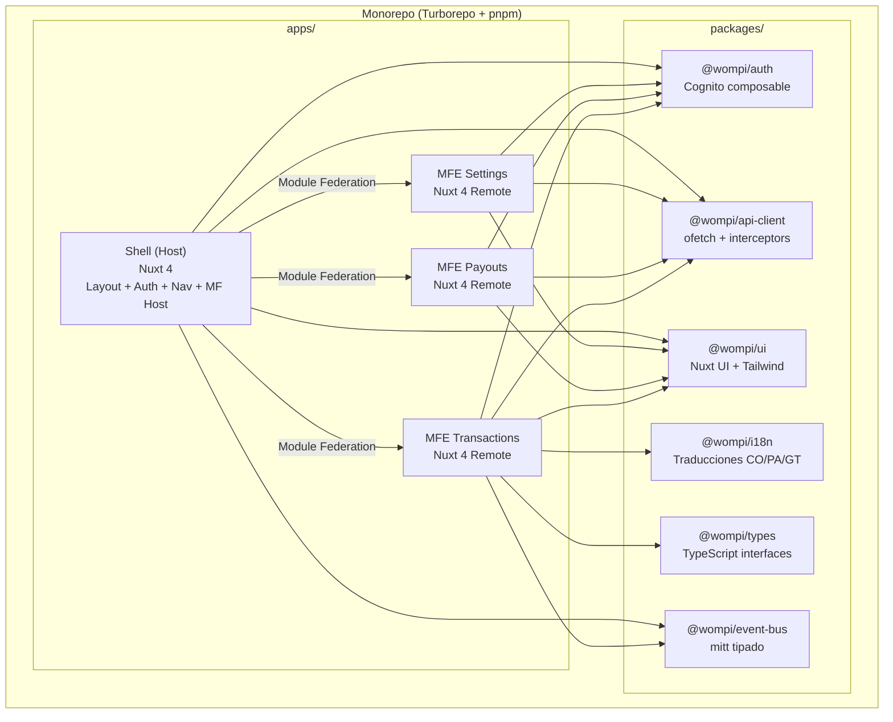
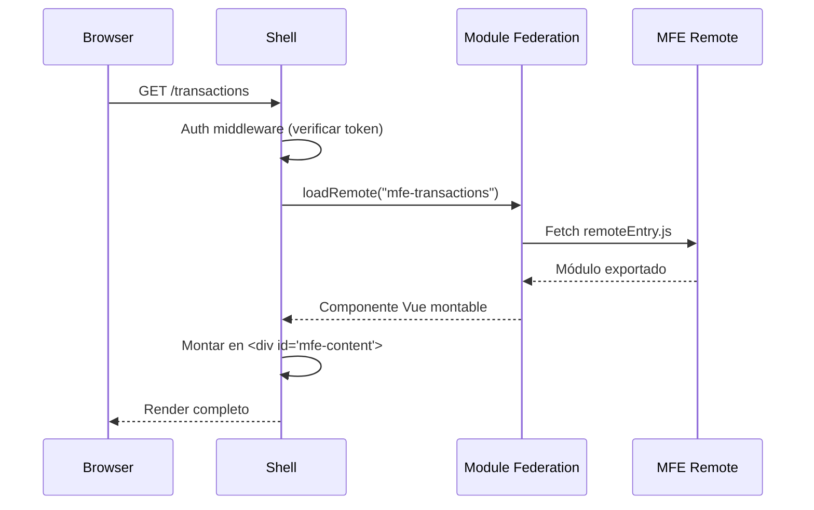

# Documento de Diseño — Migración Merchants Dashboard a Micro-Frontends

## Visión General

Este documento describe la arquitectura técnica para migrar el Merchants Dashboard de Wompi desde un monolito SPA legacy (Nuxt 1.0.0, Vue 2.7, Webpack 3, Node 12) hacia una arquitectura de micro-frontends con Nuxt 4, Vue 3, TypeScript, Module Federation y Turborepo.

La migración se ejecuta en un hackathon de 48 horas con 4 personas. El diseño prioriza pragmatismo: reutilizar lógica existente, adaptar en vez de reescribir, y entregar un MVP funcional demostrable.

### Decisiones Clave de Diseño

| Decisión | Elección | Justificación |
|----------|----------|---------------|
| Framework | Nuxt 4 (Vue 3) | Mismo ecosistema que el legacy, estructura `app/` mejorada, mejor TypeScript |
| Monorepo | Turborepo + pnpm workspaces | Build caching, paralelismo, resolución de deps interna |
| MFE Runtime | `@module-federation/vite` | Integración nativa con Vite (bundler de Nuxt 4) |
| Estado | Pinia (Composition API) | Migración casi 1:1 desde Vuex, tipado nativo |
| HTTP Client | `ofetch` (nativo Nuxt 4) | Reemplaza axios 0.x, interceptors via hooks, 0 CVEs |
| UI | Nuxt UI v3 + Tailwind CSS 4 | Reemplaza Element UI 2.x, componentes accesibles |
| Auth | `amazon-cognito-identity-js` + composable | Misma librería, envuelta en composable tipado |
| Comunicación MFE | Event Bus tipado (mitt) | Ligero, tipado, sin dependencias pesadas |

---

## Arquitectura

### Diagrama de Arquitectura General



### Flujo de Carga en Runtime



---

## Componentes e Interfaces

### 1. Estructura del Monorepo

```
merchants-dashboard-mfe/
├── apps/
│   ├── shell/                    # Host — Nuxt 4
│   │   ├── app/
│   │   │   ├── app.vue
│   │   │   ├── layouts/
│   │   │   │   └── default.vue       # Sidebar + Header + Content
│   │   │   ├── pages/
│   │   │   │   ├── index.vue         # Redirect a /transactions
│   │   │   │   ├── login.vue
│   │   │   │   └── [...slug].vue     # Catch-all → carga MFE dinámico
│   │   │   ├── middleware/
│   │   │   │   └── auth.global.ts
│   │   │   ├── composables/
│   │   │   │   └── useMerchantContext.ts
│   │   │   └── components/
│   │   │       ├── AppSidebar.vue
│   │   │       ├── AppHeader.vue
│   │   │       └── MfeLoader.vue     # Wrapper Module Federation
│   │   ├── shared/                   # Nuxt 4: código compartido app/server
│   │   │   └── types/
│   │   └── nuxt.config.ts
│   │
│   ├── mfe-transactions/         # Remote — Nuxt 4
│   │   ├── app/
│   │   │   ├── app.vue
│   │   │   ├── pages/
│   │   │   │   ├── index.vue         # Lista transacciones
│   │   │   │   ├── [id].vue          # Detalle transacción
│   │   │   │   ├── disputes/
│   │   │   │   │   ├── index.vue
│   │   │   │   │   └── [id].vue
│   │   │   │   └── payment-links/
│   │   │   │       ├── index.vue
│   │   │   │       ├── create.vue
│   │   │   │       └── [id].vue
│   │   │   ├── stores/
│   │   │   │   ├── transactions.ts
│   │   │   │   ├── disputes.ts
│   │   │   │   └── paymentLinks.ts
│   │   │   └── composables/
│   │   └── nuxt.config.ts
│   │
│   ├── mfe-payouts/              # Remote — Nuxt 4
│   │   ├── app/
│   │   │   ├── app.vue
│   │   │   ├── pages/
│   │   │   │   ├── balances.vue
│   │   │   │   ├── create-payment.vue
│   │   │   │   ├── transactions.vue
│   │   │   │   ├── approvals.vue
│   │   │   │   ├── favorites.vue
│   │   │   │   ├── limits.vue
│   │   │   │   └── reports.vue
│   │   │   ├── stores/
│   │   │   │   ├── balances.ts
│   │   │   │   ├── payments.ts
│   │   │   │   └── approvals.ts
│   │   │   └── composables/
│   │   └── nuxt.config.ts
│   │
│   └── mfe-settings/             # Remote — Nuxt 4
│       ├── app/
│       │   ├── app.vue
│       │   ├── pages/
│       │   │   ├── users/
│       │   │   │   ├── index.vue
│       │   │   │   ├── create.vue
│       │   │   │   └── [id].vue
│       │   │   ├── roles/
│       │   │   │   ├── index.vue
│       │   │   │   ├── create.vue
│       │   │   │   └── [id].vue
│       │   │   ├── keys.vue
│       │   │   ├── my-account.vue
│       │   │   └── developers.vue
│       │   └── stores/
│       │       ├── users.ts
│       │       └── roles.ts
│       └── nuxt.config.ts
│
├── packages/
│   ├── auth/                     # @wompi/auth
│   │   ├── composables/
│   │   │   └── useAuth.ts
│   │   ├── utils/
│   │   │   └── cognito.ts
│   │   └── index.ts
│   │
│   ├── api-client/               # @wompi/api-client
│   │   ├── client.ts
│   │   ├── interceptors.ts
│   │   ├── types.ts
│   │   └── index.ts
│   │
│   ├── ui/                       # @wompi/ui
│   │   ├── components/
│   │   │   ├── WDataTable.vue
│   │   │   ├── WFilterPanel.vue
│   │   │   ├── WStatusBadge.vue
│   │   │   └── WCopyButton.vue
│   │   ├── tailwind.config.ts
│   │   └── index.ts
│   │
│   ├── i18n/                     # @wompi/i18n
│   │   ├── locales/
│   │   │   ├── es_CO.json
│   │   │   ├── es_PA.json
│   │   │   └── es_GT.json
│   │   └── index.ts
│   │
│   ├── event-bus/                # @wompi/event-bus
│   │   ├── bus.ts
│   │   ├── types.ts
│   │   └── index.ts
│   │
│   └── types/                    # @wompi/types
│       ├── transaction.ts
│       ├── payout.ts
│       ├── merchant.ts
│       ├── user.ts
│       └── index.ts
│
├── turbo.json
├── package.json
├── pnpm-workspace.yaml
└── tsconfig.base.json
```

### 2. Configuración Turborepo

```jsonc
// turbo.json
{
  "$schema": "https://turbo.build/schema.json",
  "tasks": {
    "build": {
      "dependsOn": ["^build"],
      "outputs": [".output/**", ".nuxt/**", "dist/**"]
    },
    "dev": {
      "dependsOn": ["^build"],
      "cache": false,
      "persistent": true
    },
    "lint": {
      "dependsOn": ["^build"]
    },
    "test": {
      "dependsOn": ["^build"]
    }
  }
}
```

```yaml
# pnpm-workspace.yaml
packages:
  - "apps/*"
  - "packages/*"
```

```jsonc
// package.json (raíz)
{
  "name": "merchants-dashboard-mfe",
  "private": true,
  "scripts": {
    "dev": "turbo run dev",
    "build": "turbo run build",
    "lint": "turbo run lint",
    "test": "turbo run test"
  },
  "devDependencies": {
    "turbo": "^2.5.0",
    "typescript": "^5.8.0"
  },
  "packageManager": "pnpm@9.15.0"
}
```

### 3. Module Federation — Configuración Host (Shell)

```typescript
// apps/shell/nuxt.config.ts
import { createModuleFederationConfig } from '@module-federation/vite'

export default defineNuxtConfig({
  devtools: { enabled: true },
  ssr: false, // SPA mode — igual que el legacy

  // Nuxt 4: estructura app/ habilitada por defecto
  modules: ['@nuxt/ui'],

  vite: {
    plugins: [
      createModuleFederationConfig({
        name: 'shell',
        remotes: {
          'mfe-transactions': {
            type: 'module',
            name: 'mfe-transactions',
            entry: process.env.MFE_TRANSACTIONS_URL || 'http://localhost:3001/remoteEntry.js',
          },
          'mfe-payouts': {
            type: 'module',
            name: 'mfe-payouts',
            entry: process.env.MFE_PAYOUTS_URL || 'http://localhost:3002/remoteEntry.js',
          },
          'mfe-settings': {
            type: 'module',
            name: 'mfe-settings',
            entry: process.env.MFE_SETTINGS_URL || 'http://localhost:3003/remoteEntry.js',
          },
        },
        shared: {
          vue: { singleton: true, requiredVersion: '^3.5.0' },
          pinia: { singleton: true, requiredVersion: '^3.0.0' },
          'vue-i18n': { singleton: true, requiredVersion: '^11.0.0' },
          ofetch: { singleton: true },
        },
      }),
    ],
  },
})
```

### 4. Module Federation — Configuración Remote (MFE)

```typescript
// apps/mfe-transactions/nuxt.config.ts
import { createModuleFederationConfig } from '@module-federation/vite'

export default defineNuxtConfig({
  devtools: { enabled: true },
  ssr: false,
  modules: ['@nuxt/ui'],

  vite: {
    plugins: [
      createModuleFederationConfig({
        name: 'mfe-transactions',
        filename: 'remoteEntry.js',
        exposes: {
          './TransactionsApp': './app/app.vue',
        },
        shared: {
          vue: { singleton: true, requiredVersion: '^3.5.0' },
          pinia: { singleton: true, requiredVersion: '^3.0.0' },
          'vue-i18n': { singleton: true, requiredVersion: '^11.0.0' },
          ofetch: { singleton: true },
        },
      }),
    ],
  },
})
```


### 5. Shell App — Layout y Routing

El Shell replica la estructura del layout legacy (`layoutSidebar.vue`) con tres zonas: sidebar, header y contenido.

```vue
<!-- apps/shell/app/layouts/default.vue -->
<template>
  <div class="flex h-screen bg-gray-50">
    <!-- Sidebar -->
    <AppSidebar
      :is-sandbox="isSandbox"
      :merchant="currentMerchant"
      @navigate="handleNavigation"
    />

    <!-- Main content -->
    <div class="flex flex-1 flex-col overflow-hidden">
      <!-- Header -->
      <AppHeader
        :merchant="currentMerchant"
        :environment="currentEnvironment"
        :user="user"
        @toggle-environment="toggleEnvironment"
        @logout="logout"
      />

      <!-- MFE Content Area -->
      <main class="flex-1 overflow-y-auto p-6">
        <NuxtPage />
      </main>
    </div>
  </div>
</template>

<script setup lang="ts">
import { useAuth } from '@wompi/auth'
import { useEventBus } from '@wompi/event-bus'
import { useMerchantContext } from '~/composables/useMerchantContext'

const { user, logout, isAuthenticated } = useAuth()
const { currentMerchant, currentEnvironment, isSandbox, toggleEnvironment } = useMerchantContext()
const { emit } = useEventBus()

function handleNavigation(path: string) {
  navigateTo(path)
}
</script>
```

#### Auth Middleware Global

```typescript
// apps/shell/app/middleware/auth.global.ts
export default defineNuxtRouteMiddleware((to) => {
  const publicRoutes = ['/login', '/password-recovery', '/register', '/confirm-code']

  if (publicRoutes.some(route => to.path.startsWith(route))) {
    return
  }

  const token = localStorage.getItem('token')
  if (!token) {
    return navigateTo('/login')
  }
})
```

#### MFE Loader — Carga Dinámica de Remotes

```vue
<!-- apps/shell/app/components/MfeLoader.vue -->
<template>
  <Suspense>
    <template #default>
      <component :is="remoteComponent" v-if="remoteComponent" />
    </template>
    <template #fallback>
      <div class="flex items-center justify-center h-64">
        <UIcon name="i-heroicons-arrow-path" class="animate-spin h-8 w-8 text-pink-500" />
      </div>
    </template>
  </Suspense>
  <div v-if="error" class="text-center py-16">
    <UIcon name="i-heroicons-exclamation-triangle" class="h-12 w-12 text-red-500 mx-auto mb-4" />
    <p class="text-gray-600">No se pudo cargar el módulo. Intenta recargar la página.</p>
    <UButton class="mt-4" @click="retry">Reintentar</UButton>
  </div>
</template>

<script setup lang="ts">
import { loadRemote } from '@module-federation/runtime'

const props = defineProps<{ remoteName: string; exposedModule: string }>()

const remoteComponent = shallowRef()
const error = ref(false)

async function loadMfe() {
  try {
    error.value = false
    const module = await loadRemote(`${props.remoteName}/${props.exposedModule}`)
    remoteComponent.value = module?.default || module
  } catch (e) {
    console.error(`Error cargando MFE ${props.remoteName}:`, e)
    error.value = true
  }
}

function retry() {
  loadMfe()
}

onMounted(loadMfe)
</script>
```

#### Catch-All Route para MFEs

```vue
<!-- apps/shell/app/pages/[...slug].vue -->
<template>
  <MfeLoader
    v-if="mfeConfig"
    :remote-name="mfeConfig.remote"
    :exposed-module="mfeConfig.module"
  />
  <div v-else class="text-center py-16">
    <p class="text-gray-500">Página no encontrada</p>
  </div>
</template>

<script setup lang="ts">
const route = useRoute()

const mfeRouteMap: Record<string, { remote: string; module: string }> = {
  transactions: { remote: 'mfe-transactions', module: 'TransactionsApp' },
  disputes: { remote: 'mfe-transactions', module: 'TransactionsApp' },
  'payment-links': { remote: 'mfe-transactions', module: 'TransactionsApp' },
  payouts: { remote: 'mfe-payouts', module: 'PayoutsApp' },
  users: { remote: 'mfe-settings', module: 'SettingsApp' },
  roles: { remote: 'mfe-settings', module: 'SettingsApp' },
  keys: { remote: 'mfe-settings', module: 'SettingsApp' },
  'my-account': { remote: 'mfe-settings', module: 'SettingsApp' },
  developers: { remote: 'mfe-settings', module: 'SettingsApp' },
}

const mfeConfig = computed(() => {
  const slug = route.params.slug as string[]
  const firstSegment = slug?.[0]
  return firstSegment ? mfeRouteMap[firstSegment] : null
})
</script>
```

### 6. Merchant Context Provider

```typescript
// apps/shell/app/composables/useMerchantContext.ts
import { useEventBus } from '@wompi/event-bus'
import type { Merchant, ApiEnvironment } from '@wompi/types'

export function useMerchantContext() {
  const { emit } = useEventBus()

  const currentMerchant = ref<Merchant | null>(null)
  const merchants = ref<Merchant[]>([])

  // Ambiente: producción o sandbox
  const currentEnvironment = ref<ApiEnvironment>({
    tag: 'production',
    name: 'Producción',
    type: 'prod',
    baseUrl: String(import.meta.env.VITE_API_GW_BASE_URL),
  })

  const isSandbox = computed(() => currentEnvironment.value.type.includes('test'))

  function selectMerchant(merchant: Merchant) {
    currentMerchant.value = merchant
    sessionStorage.setItem('userPrincipalID', merchant.id)
    emit('merchant:changed', { merchantId: merchant.id, merchant })
  }

  function toggleEnvironment() {
    const isSandboxNow = isSandbox.value
    currentEnvironment.value = isSandboxNow
      ? {
          tag: 'production',
          name: 'Producción',
          type: 'prod',
          baseUrl: String(import.meta.env.VITE_API_GW_BASE_URL),
        }
      : {
          tag: 'sandbox',
          name: 'Sandbox',
          type: 'test',
          baseUrl: String(import.meta.env.VITE_API_GW_BASE_URL_SANDBOX),
        }

    localStorage.setItem('apiEnvironment', JSON.stringify(currentEnvironment.value))
    emit('environment:changed', { environment: currentEnvironment.value })
  }

  return {
    currentMerchant,
    merchants,
    currentEnvironment,
    isSandbox,
    selectMerchant,
    toggleEnvironment,
  }
}
```

---

### 7. Package `@wompi/auth` — Composable de Autenticación

Envuelve la lógica existente de `utils/awsCognito.js` y `store/storage.js` en un composable tipado.

```typescript
// packages/auth/composables/useAuth.ts
import {
  CognitoUserPool,
  CognitoUser,
  AuthenticationDetails,
  CognitoRefreshToken,
} from 'amazon-cognito-identity-js'
import type { AuthState, LoginCredentials, CognitoTokens } from '@wompi/types'

const poolData = {
  UserPoolId: String(import.meta.env.VITE_DASHBOARD_USER_POOL_ID),
  ClientId: String(import.meta.env.VITE_DASHBOARD_CLIENT_ID),
}

// Estado global compartido (singleton via module scope)
const authState = reactive<AuthState>({
  user: null,
  tokens: null,
  isAuthenticated: false,
})

export function useAuth() {
  const userPool = new CognitoUserPool(poolData)

  async function login({ username, password }: LoginCredentials): Promise<void> {
    const authDetails = new AuthenticationDetails({
      Username: username,
      Password: password,
    })

    const cognitoUser = new CognitoUser({ Username: username, Pool: userPool })
    cognitoUser.setAuthenticationFlowType('USER_PASSWORD_AUTH')

    return new Promise((resolve, reject) => {
      cognitoUser.authenticateUser(authDetails, {
        onSuccess: (session) => {
          const tokens: CognitoTokens = {
            accessToken: session.getAccessToken().getJwtToken(),
            idToken: session.getIdToken().getJwtToken(),
            refreshToken: session.getRefreshToken().getToken(),
          }
          saveSession(tokens, username)
          resolve()
        },
        newPasswordRequired: (session) => {
          // Manejar cambio de contraseña forzado
          reject({ isRecovery: true, session })
        },
        onFailure: (error) => reject(error),
      })
    })
  }

  async function refreshSession(): Promise<CognitoTokens> {
    const userName = localStorage.getItem('userName')
    const refreshToken = localStorage.getItem('refreshToken')

    if (!userName || !refreshToken) throw new Error('No session to refresh')

    const cognitoUser = new CognitoUser({ Username: userName, Pool: userPool })
    const refreshTokenObj = new CognitoRefreshToken({ RefreshToken: refreshToken })

    return new Promise((resolve, reject) => {
      cognitoUser.refreshSession(refreshTokenObj, (err, session) => {
        if (err) return reject(err)
        const tokens: CognitoTokens = {
          accessToken: session.getAccessToken().getJwtToken(),
          idToken: session.getIdToken().getJwtToken(),
          refreshToken: refreshToken, // El refresh token no cambia
        }
        saveSession(tokens, userName)
        resolve(tokens)
      })
    })
  }

  function logout() {
    localStorage.removeItem('token')
    localStorage.removeItem('idToken')
    localStorage.removeItem('refreshToken')
    localStorage.removeItem('userName')
    localStorage.removeItem('userUUID')
    sessionStorage.clear()

    authState.user = null
    authState.tokens = null
    authState.isAuthenticated = false

    navigateTo('/login')
  }

  function saveSession(tokens: CognitoTokens, userName: string) {
    localStorage.setItem('token', tokens.accessToken)
    localStorage.setItem('idToken', tokens.idToken)
    localStorage.setItem('refreshToken', tokens.refreshToken)
    localStorage.setItem('userName', userName)

    authState.tokens = tokens
    authState.isAuthenticated = true
  }

  return {
    user: computed(() => authState.user),
    tokens: computed(() => authState.tokens),
    isAuthenticated: computed(() => authState.isAuthenticated),
    login,
    refreshSession,
    logout,
  }
}
```

### 8. Package `@wompi/api-client` — HTTP Client con Interceptors

Reemplaza `api/api.js` + `api/interceptors.js` con ofetch tipado.

```typescript
// packages/api-client/client.ts
import { ofetch, type FetchOptions } from 'ofetch'
import type { ApiClientConfig } from '@wompi/types'

export function createApiClient(config: ApiClientConfig = {}) {
  const {
    baseUrl,
    timeout = 60000,
    useAuth = true,
    usePrefix = true,
    onUnauthorized,
    getToken,
    refreshSession,
  } = config

  const resolvedBaseUrl = computed(() => {
    const url = baseUrl || localStorage.getItem('apiEnvironment')
      ? JSON.parse(localStorage.getItem('apiEnvironment')!).baseUrl
      : String(import.meta.env.VITE_API_GW_BASE_URL)

    if (!usePrefix) return url
    return url.endsWith('/') ? `${url}dashboard` : `${url}/dashboard`
  })

  return ofetch.create({
    baseURL: resolvedBaseUrl.value,
    timeout,

    async onRequest({ options }) {
      if (!useAuth) return

      // Refresh token antes de cada request (misma lógica que interceptors.js)
      if (refreshSession) {
        try {
          await refreshSession()
        } catch (firstError) {
          // Retry una vez (misma lógica del legacy: 2 intentos)
          try {
            await refreshSession()
          } catch {
            onUnauthorized?.()
            throw new Error('Session refresh failed')
          }
        }
      }

      const token = getToken?.() || localStorage.getItem('token')
      const userPrincipalID = sessionStorage.getItem('userPrincipalID')

      if (token) {
        options.headers = {
          ...options.headers,
          Authorization: `Bearer ${token}`,
        }
      }

      if (userPrincipalID) {
        options.headers = {
          ...options.headers,
          'User-Principal-Id': userPrincipalID,
        }
      }
    },

    onResponseError({ response }) {
      if (response.status === 401) {
        onUnauthorized?.()
      }
    },
  })
}
```

```typescript
// packages/api-client/index.ts
import { createApiClient } from './client'
import { useAuth } from '@wompi/auth'

// Factory que conecta auth con api-client
export function useApiClient() {
  const { refreshSession, logout } = useAuth()

  return createApiClient({
    useAuth: true,
    refreshSession,
    onUnauthorized: logout,
  })
}

// Re-export para uso directo
export { createApiClient }
export type * from './types'
```

### 9. Package `@wompi/event-bus` — Comunicación Cross-MFE

```typescript
// packages/event-bus/types.ts
import type { Merchant, ApiEnvironment } from '@wompi/types'

export interface EventMap {
  'merchant:changed': { merchantId: string; merchant: Merchant }
  'environment:changed': { environment: ApiEnvironment }
  'auth:logout': void
  'auth:session-refreshed': { accessToken: string }
}

export type EventKey = keyof EventMap
export type EventHandler<K extends EventKey> = (payload: EventMap[K]) => void
```

```typescript
// packages/event-bus/bus.ts
import mitt from 'mitt'
import type { EventMap, EventKey, EventHandler } from './types'

// Singleton — una sola instancia compartida via Module Federation
const emitter = mitt<EventMap>()

// Registry para cleanup automático por MFE
const subscriptionRegistry = new Map<string, Array<() => void>>()

export function useEventBus(mfeId?: string) {
  function emit<K extends EventKey>(event: K, payload: EventMap[K]) {
    emitter.emit(event, payload)
  }

  function on<K extends EventKey>(event: K, handler: EventHandler<K>) {
    emitter.on(event, handler)

    // Registrar para cleanup automático
    if (mfeId) {
      const cleanups = subscriptionRegistry.get(mfeId) || []
      cleanups.push(() => emitter.off(event, handler))
      subscriptionRegistry.set(mfeId, cleanups)
    }

    // Retornar función de unsubscribe
    return () => emitter.off(event, handler)
  }

  function cleanup() {
    if (!mfeId) return
    const cleanups = subscriptionRegistry.get(mfeId)
    cleanups?.forEach(fn => fn())
    subscriptionRegistry.delete(mfeId)
  }

  return { emit, on, cleanup }
}
```

### 10. Package `@wompi/i18n` — Internacionalización

```typescript
// packages/i18n/index.ts
import es_CO from './locales/es_CO.json'
import es_PA from './locales/es_PA.json'
import es_GT from './locales/es_GT.json'

export const messages = { es_CO, es_PA, es_GT }

export const i18nConfig = {
  locale: String(import.meta.env.VITE_I18N_LOCALE || 'es_CO'),
  fallbackLocale: String(import.meta.env.VITE_I18N_FALLBACK_LOCALE || 'es_PA'),
  messages,
}
```


---

## Modelos de Datos

### Tipos TypeScript Compartidos

```typescript
// packages/types/merchant.ts
export interface Merchant {
  id: string
  name: string
  legal_name: string | null
  legal_id: string | null
  legal_id_type: string | null
  is_gateway: boolean
  active: boolean
  public_key: string | null
  email: string | null
  phone_number: string | null
}

export interface ApiEnvironment {
  tag: 'production' | 'sandbox'
  name: string
  type: string // 'prod' | 'test' | 'stagint' | 'stagtest' | 'devint' | 'devtest'
  baseUrl: string
}
```

```typescript
// packages/types/transaction.ts
export interface Transaction {
  id: string
  reference: string
  amount_in_cents: number
  currency: string
  payment_method_type: string
  status: TransactionStatus
  source_channel: string
  customer_email: string | null
  created_at: string
  finalized_at: string | null
  payment_method: PaymentMethod
}

export type TransactionStatus =
  | 'APPROVED'
  | 'DECLINED'
  | 'VOIDED'
  | 'ERROR'
  | 'PENDING'

export interface TransactionFilters {
  id: string
  reference: string
  customer_email: string
  is_strict_payment_method_type: boolean
  status: string
  payment_method_type: string
  source_channel: string
}

export interface PaymentMethod {
  type: string
  extra: Record<string, unknown>
}
```

```typescript
// packages/types/payout.ts
export interface PayoutBalance {
  available_amount: number
  currency: string
  auto_payment_enabled: boolean
}

export interface PayoutTransaction {
  id: string
  amount_in_cents: number
  status: PayoutStatus
  created_at: string
  destination: PayoutDestination
}

export type PayoutStatus = 'PENDING' | 'APPROVED' | 'REJECTED' | 'COMPLETED'

export interface PayoutDestination {
  type: 'BANK_ACCOUNT' | 'FAVORITE'
  bank_name?: string
  account_number?: string
  account_type?: string
}

export interface CreatePayoutRequest {
  amount_in_cents: number
  destination: PayoutDestination
  concept: string
  payment_type: string
}
```

```typescript
// packages/types/user.ts
export interface DashboardUser {
  id: string
  name: string
  email: string
  phone: string | null
  role: UserRole
  status: 'ACTIVE' | 'DISABLED'
  created_at: string
}

export interface UserRole {
  id: string
  name: string
  permissions: Permission[]
}

export interface Permission {
  id: string
  module: string
  action: string
}

export interface CreateUserRequest {
  name: string
  email: string
  phone: string
  role_id: string
}
```

```typescript
// packages/types/auth.ts
export interface CognitoTokens {
  accessToken: string
  idToken: string
  refreshToken: string
}

export interface AuthState {
  user: CognitoUserInfo | null
  tokens: CognitoTokens | null
  isAuthenticated: boolean
}

export interface CognitoUserInfo {
  userName: string
  email: string
  name: string
}

export interface LoginCredentials {
  username: string
  password: string
}

export interface ApiClientConfig {
  baseUrl?: string
  timeout?: number
  useAuth?: boolean
  usePrefix?: boolean
  onUnauthorized?: () => void
  getToken?: () => string | null
  refreshSession?: () => Promise<unknown>
}
```

### Migración de Estado: Vuex + vuex-saga → Pinia

El patrón de migración es mecánico. Ejemplo real del módulo `transactions`:

```typescript
// ANTES: store/modules/transactions.js (Vuex + vuex-saga)
// state → ref()
// mutations → eliminadas (Pinia muta directamente)
// actions (generators con yield) → funciones async
// getters → computed()

// DESPUÉS: apps/mfe-transactions/stores/transactions.ts (Pinia)
import { defineStore } from 'pinia'
import type { TransactionFilters, Transaction } from '@wompi/types'
import { useApiClient } from '@wompi/api-client'

function removeEmpty(filters: TransactionFilters): Record<string, string> {
  const result: Record<string, string> = {}
  for (const [key, value] of Object.entries(filters)) {
    const str = String(value).trim()
    if (str !== '' && value !== false) {
      result[key] = str
    }
  }
  return result
}

export const useTransactionsStore = defineStore('transactions', () => {
  const api = useApiClient()

  // state → ref()
  const filters = ref<TransactionFilters>({
    id: '',
    reference: '',
    customer_email: '',
    is_strict_payment_method_type: false,
    status: '',
    payment_method_type: '',
    source_channel: '',
  })
  const loading = ref(false)
  const transactions = ref<Transaction[]>([])

  // mutations eliminadas — se muta directamente
  function setFilter(key: keyof TransactionFilters, value: string | boolean) {
    ;(filters.value as Record<string, unknown>)[key] = value
  }

  // actions (vuex-saga generators → async functions)
  async function getReport() {
    loading.value = true
    try {
      const cleanFilters = removeEmpty(filters.value)
      const data = await api('/transactions', { query: cleanFilters })
      transactions.value = data.data || []
      return data
    } finally {
      loading.value = false
    }
  }

  return { filters, loading, transactions, setFilter, getReport }
})
```

#### Tabla de Equivalencias Vuex → Pinia

| Vuex | Pinia | Notas |
|------|-------|-------|
| `state: { count: 0 }` | `const count = ref(0)` | Reactivo por defecto |
| `mutations: { SET_COUNT(state, val) { state.count = val } }` | `count.value = val` | Mutación directa, sin mutations |
| `actions: { *fetchData() { yield call(...) } }` | `async function fetchData() { await ... }` | Eliminar vuex-saga, usar async/await |
| `getters: { double: state => state.count * 2 }` | `const double = computed(() => count.value * 2)` | Computed estándar |
| `mapState(['count'])` | `const { count } = storeToRefs(store)` | Destructuring reactivo |
| `mapSagas({ fetch: 'fetchData' })` | `const { fetchData } = store` | Llamada directa |

### Diseño de MFEs

Cada MFE sigue la misma estructura interna:

```
mfe-{domain}/
├── app/
│   ├── app.vue              # Entry point expuesto via Module Federation
│   ├── pages/               # Rutas internas del MFE
│   ├── composables/         # Lógica reutilizable del dominio
│   └── components/          # Componentes específicos del dominio
├── stores/                  # Pinia stores del dominio (en shared/ o app/)
└── nuxt.config.ts           # Config con MF remote
```

#### MFE Transactions — API Integration

```typescript
// apps/mfe-transactions/app/composables/useTransactionsApi.ts
import { useApiClient } from '@wompi/api-client'
import type { Transaction, TransactionFilters } from '@wompi/types'

export function useTransactionsApi() {
  const api = useApiClient()

  async function getTransactions(filters: Partial<TransactionFilters>) {
    return api<{ data: Transaction[] }>('/transactions', { query: filters })
  }

  async function getTransaction(id: string) {
    return api<{ data: Transaction }>(`/transactions/${id}`)
  }

  async function downloadReport(filters: Partial<TransactionFilters>, format: 'csv' | 'xlsx') {
    return api(`/transactions/report`, {
      query: { ...filters, format },
      responseType: 'blob',
    })
  }

  return { getTransactions, getTransaction, downloadReport }
}
```

#### MFE Payouts — API Integration

```typescript
// apps/mfe-payouts/app/composables/usePayoutsApi.ts
import { useApiClient } from '@wompi/api-client'
import type { PayoutBalance, CreatePayoutRequest } from '@wompi/types'

export function usePayoutsApi() {
  const api = useApiClient()

  async function getBalance(merchantId: string) {
    return api<{ data: PayoutBalance }>(`/transversal/balances/${merchantId}`)
  }

  async function updateAutoPayment(merchantId: string, activate: boolean) {
    return api(`/transversal/balances/${merchantId}/status`, {
      method: 'PATCH',
      body: { activate },
    })
  }

  async function createPayout(payload: CreatePayoutRequest) {
    return api('/payouts', { method: 'POST', body: payload })
  }

  async function getLimits() {
    return api('/payouts/limits', {
      headers: { 'business-application-id': 'WOMPI_PAYINS' },
    })
  }

  return { getBalance, updateAutoPayment, createPayout, getLimits }
}
```

#### Suscripción a Eventos del Shell

Cada MFE se suscribe a eventos globales al montarse y limpia al desmontarse:

```typescript
// Patrón usado en cada MFE (ej: app.vue de mfe-transactions)
import { useEventBus } from '@wompi/event-bus'

const { on, cleanup } = useEventBus('mfe-transactions')

on('merchant:changed', ({ merchantId }) => {
  // Recargar datos con el nuevo merchant
  const store = useTransactionsStore()
  store.getReport()
})

on('environment:changed', ({ environment }) => {
  // El api-client ya usa la nueva baseUrl via localStorage
  // Solo necesitamos recargar datos
  const store = useTransactionsStore()
  store.getReport()
})

onUnmounted(() => {
  cleanup() // Limpia todas las suscripciones de este MFE
})
```

---

## Correctness Properties

*Una propiedad de correctitud es una característica o comportamiento que debe mantenerse verdadero en todas las ejecuciones válidas de un sistema — esencialmente, una declaración formal sobre lo que el sistema debe hacer. Las propiedades sirven como puente entre especificaciones legibles por humanos y garantías de correctitud verificables por máquinas.*

### Property 1: API Client factory produce instancias correctamente configuradas

*Para cualquier* combinación de ambiente (sandbox/producción) y base URL, la función `createApiClient` SHALL producir una instancia HTTP cuya `baseURL` sea la concatenación correcta de la URL del ambiente con el prefijo `/dashboard`.

**Validates: Requirements 15.1**

### Property 2: Request interceptor adjunta headers de autenticación correctos

*Para cualquier* token de acceso y User-Principal-Id válidos almacenados en storage, el interceptor de request SHALL adjuntar los headers `Authorization: Bearer {token}` y `User-Principal-Id: {id}` a cada petición HTTP saliente.

**Validates: Requirements 15.2**

### Property 3: Selección de merchant actualiza contexto y emite evento

*Para cualquier* merchant ID válido, cuando el Shell ejecuta `selectMerchant`, el sistema SHALL actualizar el `userPrincipalID` en sessionStorage y emitir un evento `merchant:changed` con el ID correcto a todos los suscriptores del Event Bus.

**Validates: Requirements 4.2**

### Property 4: Transformación de filtros elimina valores vacíos

*Para cualquier* objeto de filtros de transacciones, la función `removeEmpty` SHALL retornar un objeto que contenga solo las claves cuyos valores, al convertirse a string y aplicar trim, no sean vacíos y no sean `false`.

**Validates: Requirements 6.3**

### Property 5: Creación de payment link con datos válidos invoca API correctamente

*Para cualquier* payload válido de payment link (nombre no vacío, monto > 0, moneda válida), el formulario de creación SHALL invocar el endpoint de API con el payload exacto proporcionado.

**Validates: Requirements 8.3**

### Property 6: Creación de pago con datos válidos invoca API correctamente

*Para cualquier* payload válido de pago (monto > 0, destinatario con cuenta bancaria válida, concepto no vacío), el formulario de creación SHALL invocar el endpoint de API con el payload exacto proporcionado.

**Validates: Requirements 10.2**

### Property 7: Creación de usuario con datos válidos invoca API correctamente

*Para cualquier* payload válido de usuario (nombre no vacío, email con formato válido, teléfono, rol_id existente), el formulario de creación SHALL invocar el endpoint de API con el payload exacto proporcionado.

**Validates: Requirements 12.3**

### Property 8: Paridad funcional Vuex → Pinia

*Para cualquier* secuencia de operaciones de filtrado (setFilter con claves y valores aleatorios), el Pinia store `useTransactionsStore` SHALL producir el mismo estado de filtros y la misma llamada API (mismos query params) que el módulo Vuex `transaction` original.

**Validates: Requirements 19.1, 19.2**

### Property 9: Event Bus entrega eventos a todos los suscriptores

*Para cualquier* tipo de evento del EventMap y cualquier número de suscriptores (1 a N), cuando se emite un evento, todos los handlers suscritos SHALL recibir el payload exacto emitido.

**Validates: Requirements 20.1**

### Property 10: Event Bus limpia suscripciones al desmontar MFE

*Para cualquier* conjunto de suscripciones registradas bajo un `mfeId`, después de ejecutar `cleanup()`, ninguna de esas suscripciones SHALL recibir eventos futuros.

**Validates: Requirements 20.4**

---

## Manejo de Errores

### Estrategia por Capa

| Capa | Error | Manejo |
|------|-------|--------|
| Auth | Login fallido | Mostrar mensaje de error en formulario |
| Auth | Refresh token fallido (2x) | Logout automático + redirect a `/login` |
| API Client | HTTP 401 | Invocar `logout()` del package auth |
| API Client | HTTP 4xx/5xx | Propagar error al componente que lo invocó |
| API Client | Timeout (60s) | Mostrar toast de error con opción de reintentar |
| Module Federation | Remote no disponible | Mostrar `MfeLoader` con mensaje de error y botón reintentar |
| Module Federation | Versión incompatible | Recargar página para obtener nuevo `remoteEntry.js` |
| Event Bus | Handler lanza excepción | Capturar con try/catch, loguear, no propagar a otros handlers |
| Pinia Store | Error en action async | Setear `error` ref en el store, mostrar en UI |

### Patrón de Error en Stores

```typescript
// Patrón estándar para manejo de errores en Pinia stores
export const useTransactionsStore = defineStore('transactions', () => {
  const loading = ref(false)
  const error = ref<string | null>(null)

  async function getReport() {
    loading.value = true
    error.value = null
    try {
      const data = await api('/transactions', { query: cleanFilters })
      transactions.value = data.data || []
    } catch (e: unknown) {
      error.value = e instanceof Error ? e.message : 'Error desconocido'
    } finally {
      loading.value = false
    }
  }

  return { loading, error, getReport }
})
```

---

## Estrategia de Testing

### Enfoque Dual: Unit Tests + Property Tests

Dado que esta migración involucra lógica de negocio pura (transformación de filtros, factory de API client, event bus, migración de estado), property-based testing es apropiado para las capas de lógica.

#### Herramientas

| Herramienta | Uso |
|-------------|-----|
| **Vitest** | Test runner (reemplaza Jest 23) |
| **fast-check** | Property-based testing |
| **@vue/test-utils** | Testing de componentes Vue 3 |
| **Playwright** | E2E tests (si hay tiempo) |

#### Configuración de Property Tests

- Librería: `fast-check` (la más madura para TypeScript/JavaScript)
- Mínimo 100 iteraciones por propiedad
- Cada test referencia la propiedad del diseño con tag:
  ```
  Feature: merchants-dashboard-mfe-migration, Property {N}: {título}
  ```

#### Distribución de Tests

| Tipo | Qué cubre | Prioridad |
|------|-----------|-----------|
| **Property tests** | removeEmpty, createApiClient, event bus pub/sub, event bus cleanup, interceptor headers, migración Vuex→Pinia | Alta |
| **Unit tests (example)** | Auth middleware redirect, 401 → logout, MFE loader error state, formularios con datos específicos | Alta |
| **Smoke tests** | Estructura monorepo, turbo.json, tsconfig, dependencias sin CVEs, tipos compilan | Media |
| **Integration tests** | Module Federation carga remotes, Cognito login flow (mock), navegación cross-MFE | Baja (si hay tiempo) |

#### Seguridad — Eliminación de CVEs

La migración elimina las 60+ vulnerabilidades del stack legacy al reemplazar:

| Dependencia Legacy (con CVEs) | Reemplazo (0 CVEs) |
|-------------------------------|---------------------|
| `nuxt@1.0.0` (Vue 2, Webpack 3) | `nuxt@4.x` (Vue 3, Vite 6) |
| `vue@2.7.16` | `vue@3.5.x` |
| `webpack@3.0.0` | `vite@6.x` (incluido en Nuxt 4) |
| `axios@0.30.3` | `ofetch@1.x` (nativo Nuxt 4) |
| `element-ui@2.3.4` | `@nuxt/ui@3.x` (Radix Vue + Tailwind) |
| `node-sass@4.14.1` | `tailwindcss@4.x` (no requiere sass) |
| `babel-core@6.26.3` + plugins | TypeScript nativo (esbuild via Vite) |
| `jest@23.4.1` | `vitest@3.x` |
| `vuex@3.x` + `vuex-saga@0.1.3` | `pinia@3.x` |
| `vue-i18n@8.27.2` | `vue-i18n@11.x` via `@nuxtjs/i18n` |
| `highlight.js@9.18.3` | Eliminar o usar `shiki` (si se necesita) |
| Node 12.22 | Node 20 LTS |

El archivo `.snyk` con vulnerabilidades ignoradas deja de ser necesario porque no hay vulnerabilidades que ignorar.
